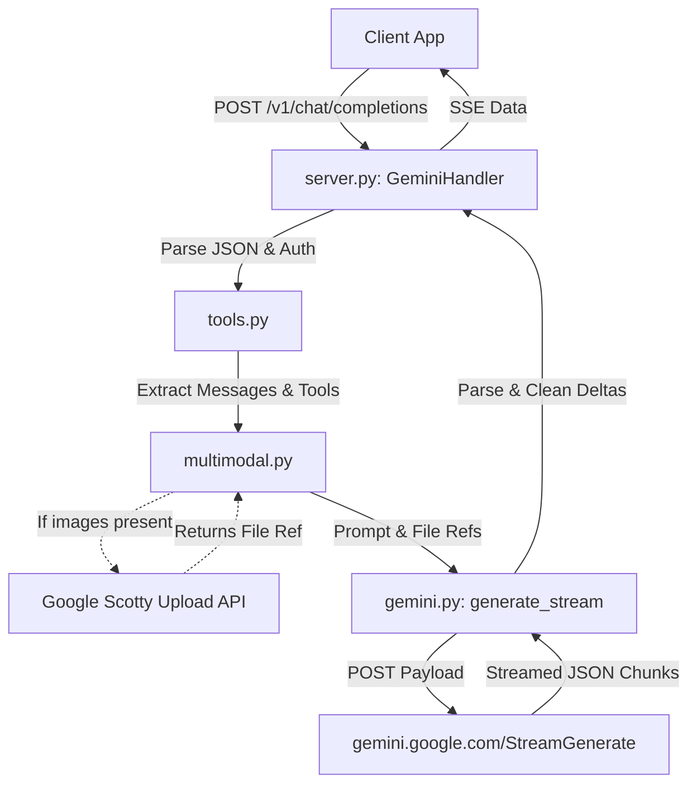

# Architecture Overview

## Architecture Style
`gemini-web2api` is a **lightweight proxy server** designed around a single-responsibility pipeline. It does not employ a complex layered architecture (like Clean Architecture or DDD) but rather a straightforward request-response adapter model. 

The architecture bridges two distinct API formats:
1. **OpenAI API** (Standardized JSON REST & SSE)
2. **Gemini Web UI Protocol** (Nested JSON arrays, Protobuf-like, undocumented)

## Component Responsibilities

- **Entry Points**
  - `gemini_web2api.py`: A standalone, self-contained implementation combining all logic into a single file (for maximum portability).
  - `gemini_web2api/__main__.py`: The module entry point for the package-based execution (`python -m gemini_web2api`), which bootstraps the server.
- **HTTP Layer (`server.py`)**
  - Uses Python's built-in `http.server.BaseHTTPRequestHandler`.
  - Responsible for routing (`/v1/chat/completions`, `/v1/models`, `/v1beta/models`).
  - Handles authentication validation (API Keys).
  - Manages Server-Sent Events (SSE) streaming connections.
- **Translation Layer (`tools.py`, `models.py`)**
  - Converts OpenAI message structures (system, user, assistant) into Google's expected format.
  - Converts OpenAI function calling specifications into text-based prompts or Google's native tool configs.
  - Resolves model aliases (e.g., `gemini-3.5-flash-thinking`) into Gemini internal identifiers (Mode, Think level).
- **Network Client Layer (`gemini.py`, `multimodal.py`)**
  - Manages HTTP connections to Google's servers.
  - Implements retry logic, cookie management, and SAPISID hash generation.
  - Uses `httpx` for streaming (if available) or falls back to `urllib`.
  - `multimodal.py` handles the specialized "Scotty" resumable upload protocol for images.
- **Cloudflare Edge Implementation (`cloudflare/worker.js`)**
  - A completely separate implementation of the architecture tailored for the Cloudflare Workers V8 Isolate environment.
  - Incorporates advanced anti-bot fingerprinting, cookie rotation, and memory-safe rate limiting.

## Entry Points

1. **Standalone Script**: `python gemini_web2api.py`
2. **Module Execution**: `python -m gemini_web2api`
3. **Docker**: `CMD ["python", "-m", "gemini_web2api", "--config", "/app/config.json"]`
4. **Cloudflare Worker**: Edge trigger via Fetch API in `worker.js`.

## Startup Sequence (Python)

1. Argument parsing (CLI args).
2. Configuration loading (from CLI args -> environment variables -> `config.json` -> defaults).
3. Port binding (default `8081`).
4. Instantiation of `ThreadedServer` (a subclass of `ThreadingMixIn` and `HTTPServer`), allowing concurrent request handling via threads.
5. `serve_forever()` loop starts listening for incoming HTTP requests.

## Runtime Flow

## Important Architectural Decisions

1. **Zero-Dependency Core**: The Python implementation relies entirely on the standard library for HTTP handling (`http.server`, `urllib`). `httpx` is the only external dependency and it is optional (used exclusively for better streaming support). This makes deployment trivial across environments.
2. **Threaded Server**: Uses `ThreadingMixIn` to handle concurrent requests. This is necessary because `urllib` and `httpx` calls are synchronous and would otherwise block the server.
3. **Dual Codebase**: The project maintains a modular codebase (`gemini_web2api/`) and a single-file codebase (`gemini_web2api.py`). The single-file version appears to be a compiled or parallel version for users who want to drop a single script into their environment.
4. **Cloudflare Separation**: The Cloudflare worker is written in JavaScript and completely independent of the Python codebase. It includes sophisticated concurrency and state isolation mechanisms required for V8 Isolates.
