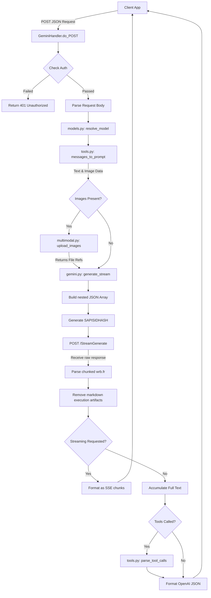

# Data Flow

This document traces the path of a standard OpenAI-compatible Chat Completion request through the system.

## 1. Chat Completion Request (`/v1/chat/completions`)



### Data Transformations

1. **Input Format (OpenAI)**: 
   ```json
   {
     "model": "gemini-3.5-flash-thinking",
     "messages": [{"role": "user", "content": "Hello"}],
     "stream": true
   }
   ```
2. **Intermediate Format (`tools.py`)**: 
   The OpenAI messages array is flattened into a single prompt string, using text markers like `[System instruction]: ...` and `[Assistant]: ...` to simulate conversation history.
3. **Payload Format (`gemini.py`)**: 
   The prompt string is placed into a highly specific array index: `inner[0] = [prompt, 0, None, refs, None, None, 0]`.
4. **Google Stream Format**: 
   Google returns a format starting with `wrb.fr` containing heavily escaped JSON strings. The client parses this using regular expressions and JSON decoding to extract text deltas.
5. **Output Format (OpenAI SSE)**:
   ```text
   data: {"id": "chatcmpl-...", "object": "chat.completion.chunk", "choices": [{"delta": {"content": "Hello"}}]}
   ```

## 2. Image Processing Flow (`multimodal.py`)

When an image is provided in the OpenAI request (either via URL or base64):

1. **Extract**: The image is extracted and base64 is decoded to raw bytes. HTTP URLs are fetched locally by the server.
2. **Token Fetch**: The server makes a background GET request to `https://gemini.google.com/app` to retrieve temporary session tokens (`push_id`, `pctx`).
3. **Start Upload**: Sends a POST request to `https://content-push.googleapis.com/upload/` with the `X-Goog-Upload-Protocol: resumable` header.
4. **Execute Upload**: Receives an upload URL, then POSTs the raw image bytes to that URL.
5. **Reference**: Receives a file reference path from Google, which is then inserted into the `refs` array of the main Gemini request payload.
